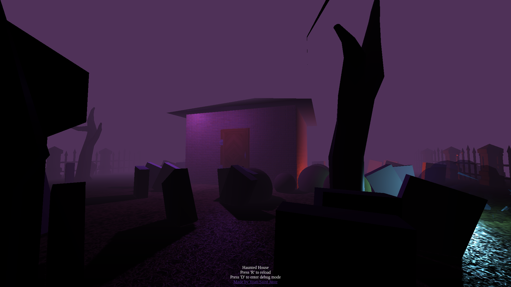

# Haunted House

<a href='https://haunted-house-gilt.vercel.app/'>
  
</a>

## What is 'Haunted House'

An experiment made to learn ThreeJS !
This one focuses on shadows and lights, and also uses a few gltf models !
[➡️ Click here to see the live experiment ⬅️](https://haunted-house-gilt.vercel.app/)

## Setup

Download [Node.js](https://nodejs.org/en/download/).
Run the followed commands:

```bash
# Install dependencies (only the first time)
npm install

# Run the local server at localhost:8080
npm run dev

# Build for production in the dist/ directory
npm run build
```

## Models used

I used a few models from the [pmndrs market](https://github.com/pmndrs/market)

- [Fence model](https://market.pmnd.rs/model/fence)
- [Jack-o'-lantern](https://market.pmnd.rs/model/jack-o-lantern)
- [Tree](https://market.pmnd.rs/model/tree-4-kaykit)

## Thanks

This experiment was made possible by [Three.js journey by Bruno Simon](https://threejs-journey.com) 🎉 <br />
I'm still learning Three.js and I hope I can make beautiful websites soon !

If you're interested at what I do you can follow me on Twitter [https://twitter.com/yoansj](https://twitter.com/yoansj) <br />

I'm currently looking for a part-time job 💼 <br />
Want to work with me ? Email me at 📧 yoansjpro@gmail.com 📧

Thanks for reading this far ! <br />
You earned the right to see my previous experiment ➡️ [https://yoan-and-donuts.vercel.app](https://yoan-and-donuts.vercel.app)
